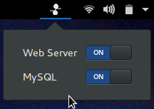

# Web Dev Panel

A [Gnome Shell Extension](https://extensions.gnome.org/) to control Web and Database Server in a GUI Panel.  This project was based upon code from [Gnome Extension: Lamp Status](https://extensions.gnome.org/extension/990/lamp-status/).

## Configuration Defaults
* Use `nginx` (instead of `apache`)
* Support Ubuntu systemd service names (`mysql` instead of `mysqld`)

**Note:**  These settings can be manually changed in the file `~/.local/share/gnome-shell/extensions/web-dev-panel@mediadoneright.com/__config.js`

## Future Development
I'd like to combine efforts with the original author.  Based on a comment to add Nginx support and lack of response (and no link to a public repo or issue queue) I created this project.  

My goal is to either:

1. Allow user to change default configuration using a GUI, or
2. Automatically configure setup based on system services

**Pull Requests** are encouraged and appreciated!
